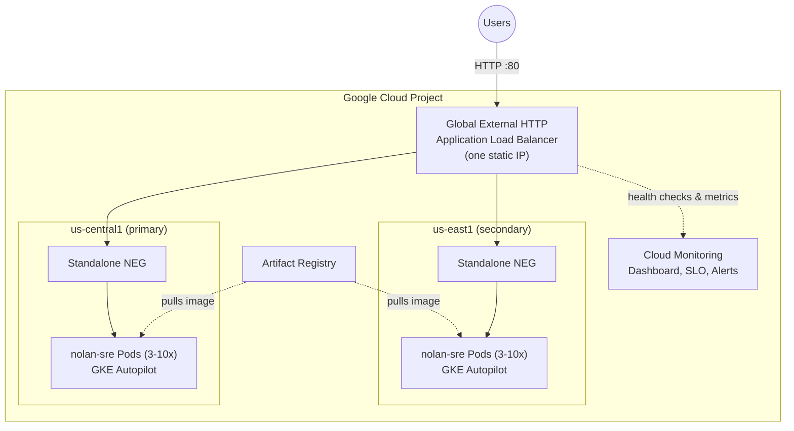

# Architecture

## Infrastructure

The platform runs in Google Cloud:

- A custom global VPC contains a regional GKE subnet in each of two regions, each with separate secondary ranges for Pods and Services.
- A Cloud Router and Cloud NAT in each region provide controlled outbound access for private nodes.
- Two regional Autopilot GKE clusters (primary and secondary, in different regions) use private nodes, a private control-plane peering range, a regular release channel, and master authorized networks for control-plane access.
- Artifact Registry stores application images, shared by both clusters.
- A global external HTTP Application Load Balancer, backed by standalone Network Endpoint Groups (NEGs) in both regions, is the single public entry point. The application Service remains `ClusterIP` inside each cluster and is annotated to expose a standalone NEG.
- Terraform state is stored in a versioned GCS bucket with uniform bucket-level access, public access prevention, and deletion protection.

The state-bootstrap Terraform configuration owns the state bucket IAM, Workload Identity Pool and provider, and GitHub service accounts. Application Terraform owns the runtime infrastructure.

Both regions run active-active behind the same load balancer; if one region's health checks fail, the load balancer shifts all traffic to the other automatically, with no DNS change.

## Application Runtime

The Kubernetes manifest creates the `nolan-sre` namespace, service account, Deployment, ClusterIP Service (annotated for a standalone NEG), HorizontalPodAutoscaler, PodDisruptionBudget, and NetworkPolicies. The identical manifest is applied to both the primary and secondary clusters.

The Deployment starts with three replicas and uses a rolling update with zero unavailable replicas and one surge replica. Images are pinned by SHA-256 digest. Readiness and liveness probes protect traffic and restart unhealthy containers.

## Reliability and Cross-Region Failover

Reliability controls include:

- Two active-active regional Autopilot GKE clusters, each with three minimum replicas and a PodDisruptionBudget requiring two available Pods.
- Topology spreading across zones and hostnames within each cluster.
- Readiness, liveness, and graceful pre-stop behavior.
- GKE maintenance windows and deletion protection.
- Immutable image references and rollout verification.
- A 30-day, 99.9% request-based availability SLO.

### How Cross-Region Failover Works

Both clusters run the full workload continuously and serve live production traffic at the same time (active-active, not cold standby) behind a single global external Application Load Balancer with one static IP address. The load balancer's backend service holds standalone NEGs from every zone in both regions, and continuously health-checks every backend endpoint over HTTP.

When a region's endpoints stop passing health checks (Pod, node, or full regional failure), the load balancer stops routing new connections to that region's backends and shifts 100% of traffic to the remaining healthy region — automatically, using the same IP address, with no DNS change and no client reconfiguration required. Detection time is governed by the health check's interval and unhealthy threshold (default: ~10s interval, 3 consecutive failures, so roughly 30-40 seconds). Failback is automatic and symmetric: once the affected region's endpoints pass health checks again, the load balancer resumes distributing traffic to both regions.

Because the application is a stateless static site with no database or persisted state, failover is a pure traffic-routing concern; there is no data replication or RPO to manage. Use `scripts/simulate-failover.sh` to run a non-destructive DR test that drains one region and confirms recovery timing.

The deployment process waits for rollout completion on both clusters before reporting success. A failed rollout should be investigated with Pod events, readiness failures, recent revisions, and backend-service health.

## Scaling

The HorizontalPodAutoscaler scales from three to ten replicas based on average CPU utilization, targeting 60%. Scale-up is immediate and scale-down is deliberately stabilized for five minutes. Autopilot and vertical pod autoscaling manage cluster capacity and resource recommendations while the workload declares CPU and memory requests and limits.

The subnet reserves independent ranges for nodes, Pods, and Services. These ranges should be sized for the expected cluster and workload growth before production use.

## Security

Security boundaries include:

- Private GKE nodes and restricted master authorized networks. `0.0.0.0/0` is never acceptable.
- GitHub OIDC with repository and branch attribute conditions.
- Short-lived credentials rather than stored service-account keys.
- Workload Identity for Google Cloud access.
- Uniform bucket-level access, public access prevention, versioned Terraform state, and deletion protection.
- Namespace Pod Security labels, disabled service-account token automounting, a runtime-default seccomp profile, and no privileged container.
- Default-deny ingress and egress NetworkPolicy, with only public gateway ingress and DNS egress allowed by the manifest.
- Non-root execution should be enabled for images that support it; the current NGINX image retains the permissions it requires and drops all capabilities before adding only its required capabilities.

Review IAM roles and network-policy requirements before adding new integrations or egress paths.

## Monitoring and SLO

Cloud Monitoring provisions an SRE dashboard with panels for:

- Traffic: HTTP request rate.
- Errors: HTTP 5xx request rate.
- Latency: HTTP p95 and p99 response latency.
- Saturation: container CPU request utilization.
- Reliability signals: container restart count.

The request-based availability SLO measures successful HTTP 200 requests to the `nolan-sre-backend` global backend service over a rolling 30-day window with a 99.9% goal. Two multi-window, multi-burn-rate alert policies are attached directly to the SLO (the pattern the Cloud Monitoring Service dashboard expects): a fast-burn policy pages when both the 1-hour and 5-minute windows exceed a 14.4x burn rate (budget exhausted in ~2 days), and a slow-burn policy tickets when both the 6-hour and 30-minute windows exceed a 6x burn rate (budget exhausted in ~5 days). Separately, configured alert policies notify email channels when 5xx traffic exceeds 1% for five minutes, p95 latency exceeds 500 milliseconds for five minutes, CPU request utilization exceeds 80% for ten minutes, containers restart during a five-minute window, or either region reports no NGINX CPU usage for five minutes (indicating that region has zero running Pods, e.g. during a full regional outage).

The four golden signals are therefore represented as request rate (traffic), 5xx rate (errors), p95/p99 response duration (latency), and CPU request utilization (saturation). Because the aggregate signals above can stay quiet during a regional failure (the other active-active region absorbs traffic seamlessly), the per-region "no running Pods" alerts close that blind spot: they fire independently for `us-central1` and `us-east1` based on metric absence, not on overall traffic health.

Use the dashboard and alert documentation as the starting point for incident response, then correlate load-balancer metrics with ingress, Service endpoints, Pod readiness, resource pressure, and rollout history.

### Links

- [Monitoring Dashboard](https://console.cloud.google.com/monitoring/dashboards/builder/1d2e2cb2-2f5c-4bb6-a0a4-f5d226b15a43;duration=PT1H?project=nolan-sre-challenge)
- [Alert Policies](https://console.cloud.google.com/monitoring/alerting/policies?project=nolan-sre-challenge&supportedpurview=folder)
- [Availability SLO](https://console.cloud.google.com/monitoring/services/93178190172/nolan-sre?project=nolan-sre-challenge&supportedpurview=folder&pageState=(%22interval%22:()))

## Next Steps

The current architecture provides cross-region high availability through two active-active regional Autopilot GKE clusters, a global external load balancer with automatic health-check-based failover, multi-zone Pod placement, multiple replicas, a PodDisruptionBudget, health probes, and load-balancer backend health checks.

Further hardening to consider:

- Automated, scheduled DR game days using `scripts/simulate-failover.sh` with alerting on detection/recovery time regressions.
- A CDN or edge caching layer if the static content profile changes.
- Terraform-managed backup and restore procedures if the application gains persistent state.
- A third region or additional zonal redundancy if availability requirements increase further.